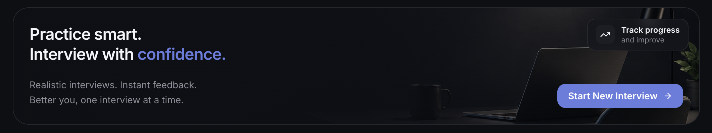
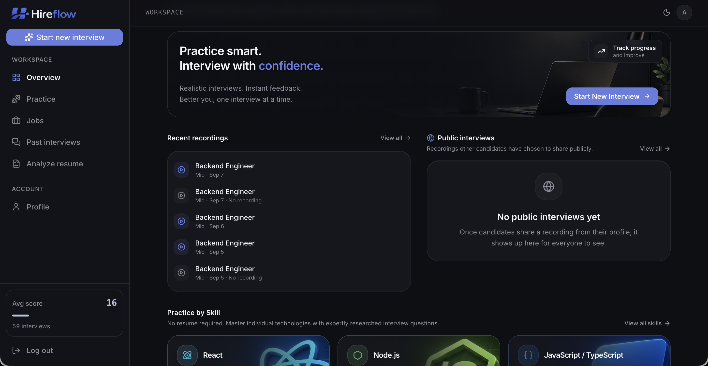
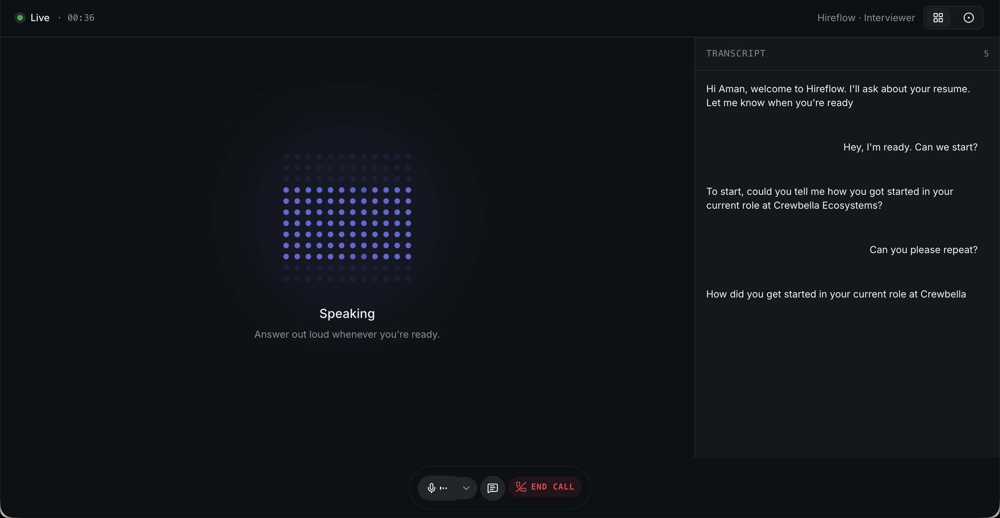
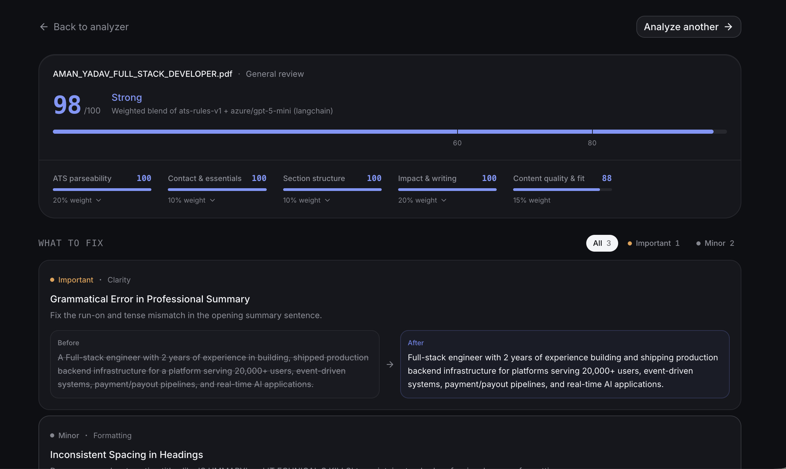
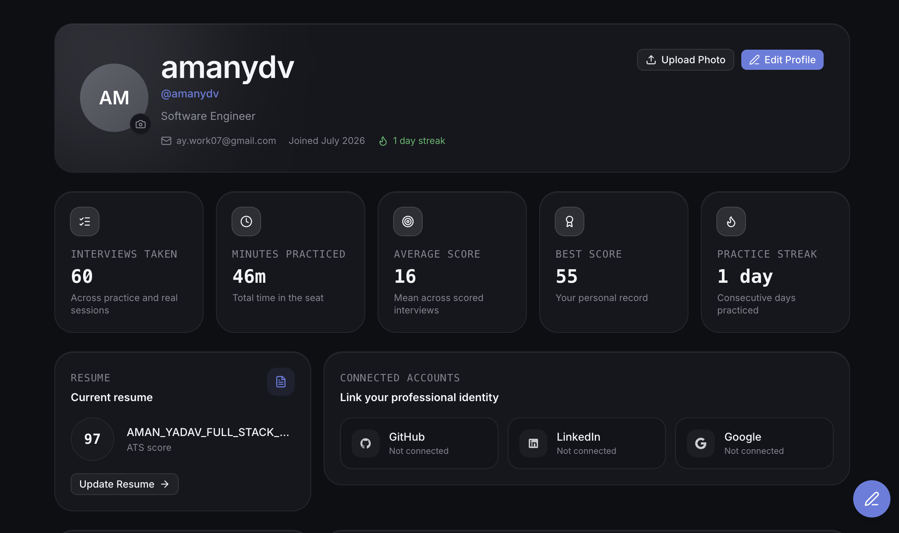
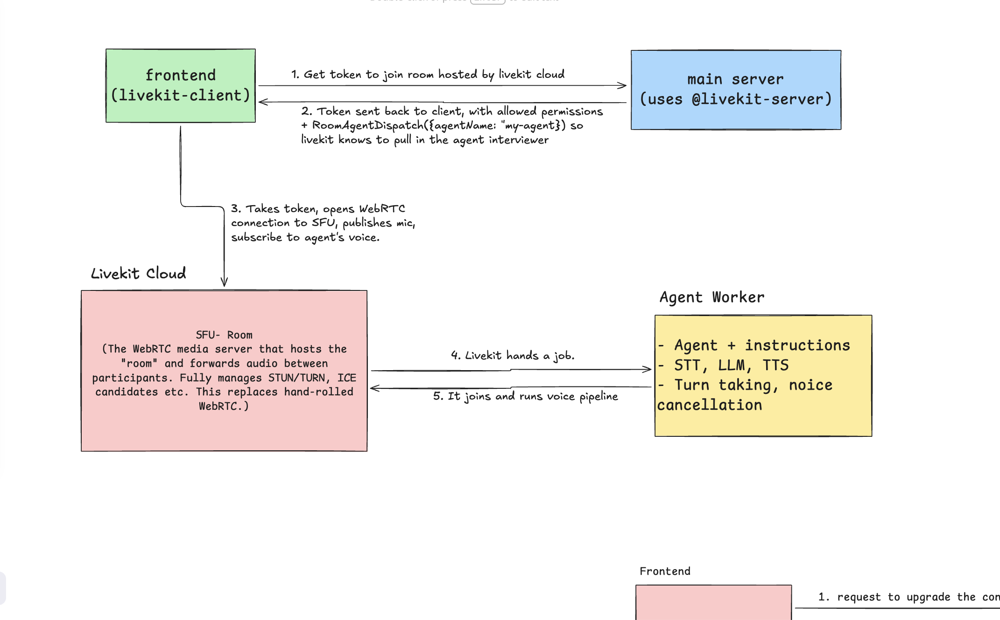

# Quick Hire
An AI-driven interview platform.


 Candidates upload a resume and pick a target role
(e.g. *Backend Engineer*); the platform scrapes their public proof-of-work, runs a
real-time **voice** interview powered by an OpenAI realtime model, scores the
transcript, and gives back a video recording plus a detailed breakdown of mistakes and
areas to improve. Interviews can be made public and shared with recruiters, who can
search by role, watch interviews, and reach out to candidates.


## 📸 Screenshots

| Dashboard Overview | AI Voice Interview Room |
|:---:|:---:|
| |  |

| Resume ATS Analyzer | Public Interview Feed |
|:---:|:---:|
|  |  |

##  Core Features

*   **Real-Time AI Voice Interviews:** Conduct lifelike mock interviews using a low-latency voice agent. Features dynamic visualizers, track controls, and transcript generation.
*   **Smart ATS Resume Analyzer:** Upload resumes to receive deep, multi-stage AI analysis. The system parses text, scores against ATS rules, and provides actionable feedback.
*   **Global Job Discovery:** Aggregates live job postings using built-in ingest pipelines from external providers (Adzuna, Arbeitnow, Remotive).
*   **Comprehensive Performance Dashboards:** Track interview scores, review historical resume analyses, and manage saved jobs.
*   **Public & Private Profiles:** Opt-in to share standout interview recordings and resume highlights on a public feed to attract recruiters.
*   **Exportable Assets:** Generate and download PDF transcripts of your AI interview sessions.

## Architecture - the "side-band" design

The hard part is doing real-time voice **without** trusting the client.



The frontend uses livekit-client to request a token from the main server to join a room hosted by LiveKit Cloud.

The main server utilizes @livekit-server to generate and send the token back to the client.

This returned token contains the allowed room permissions and a RoomAgentDispatch instruction (e.g., {agentName: "my-agent"}), signaling LiveKit to pull in the correct agent interviewer.

The frontend uses this token to open a WebRTC connection directly to the SFU (Selective Forwarding Unit), publishing the user's microphone audio and subscribing to the agent's voice.

LiveKit Cloud operates as the WebRTC media server that hosts the room and forwards audio between participants.

LiveKit Cloud fully manages STUN/TURN protocols and ICE candidates, entirely replacing the need for hand-rolled WebRTC implementations.

LiveKit Cloud then hands a job over to the Agent Worker.

The Agent Worker joins the room and executes the voice pipeline, completely isolating the agent's instructions, STT (Speech-to-Text), LLM, TTS (Text-to-Speech), turn-taking, and noise cancellation away from the client browser.

Hireflow is structured as a monorepo containing a frontend web application, a Node/Express backend, and a Python-based agent worker. **Bun** is strictly utilized as the primary runtime and package manager across the JavaScript/TypeScript ecosystem.

### Tech Stack Overview

| Category | Technology | Details |
| :--- | :--- | :--- |
| **Frontend** | React Router (v7) / Remix | Server-side rendering, nested routing, and unified data loading. |
| **UI Library** | shadcn/ui & Tailwind CSS | Highly customizable, accessible, headless UI components. |
| **Backend** | Node.js & Express | RESTful API architecture handling business logic and file uploads. |
| **Runtime / PM** | Bun | Enforced runtime for ultra-fast package installation and execution. |
| **Database** | PostgreSQL & Prisma ORM | Relational data modeling with strictly typed database client. |
| **Asynchronous** | BullMQ / Redis | Background queue processing for heavy ATS parsing and AI tasks. |
| **AI / ML** | OpenAI API & Python Worker | Powers the core conversational intelligence and ATS scoring logic. |
### Backend (`apps/backend`)

Express API under `/api/v1` (e.g. `POST /api/v1/pre-interview`). Bodies validated with
**Zod**, persistence via **Prisma 7** (client generated to `src/generated/prisma`).
Domain models: `User`, `Interview` (`SCHEDULED` / `ONGOING` / `COMPLETED`, holds
`githubMetadata` JSON), `Message` (User/Assistant transcript), and `Result` (score).

### Frontend (`apps/frontend`)

React Router 7 in framework mode (SSR). Routes are declared in `app/routes.ts` and
implemented in `app/routes/` — the flow is **form → interview → result**. API calls use
`axios` against `BACKEND_URL` from `app/lib/config.ts`.

### Shared packages (`packages/`)

`@repo/ui`, `@repo/eslint-config`, `@repo/typescript-config`.

## Getting started

Requires [Bun](https://bun.sh) `1.3.14`. Use `bun`/`bunx` — not npm/pnpm/yarn or `node`.

```sh
bun install
bun run dev          # turbo run dev — frontend + backend in parallel
```

Scope to a single app with a filter:

```sh
bunx turbo run dev --filter=frontend
```

### Backend dev server

`apps/backend` has no package scripts — run the Express entrypoint directly:

```sh
bun --hot src/index.ts          # dev server on :8000 with hot reload
```

Prisma commands must run through Bun so `.env` / `DATABASE_URL` is loaded:

```sh
bun --bun run prisma migrate dev
bun --bun run prisma generate
```

### Frontend scripts (`apps/frontend`)

```sh
bun run dev          # react-router dev
bun run build        # react-router build
bun run start        # serve the production build
bun run typecheck    # react-router typegen && tsc
```

## Common commands (repo root)

```sh
bun run dev          # turbo run dev
bun run build        # turbo run build
bun run lint         # turbo run lint
bun run check-types  # turbo run check-types
bun run format       # prettier --write on **/*.{ts,tsx,md}
```

Tests use `bun test` (none yet).

## Deployment

`compose.yml` runs four services behind nginx:

- **nginx** (port 80) — proxies `/` → `frontend:5173` and `/api/` → `backend:8000`
  (`nginx/nginx.conf`).
- **frontend**, **backend**, and a **postgres:18** `db`.

The backend healthcheck targets `/api/v1/health`.
